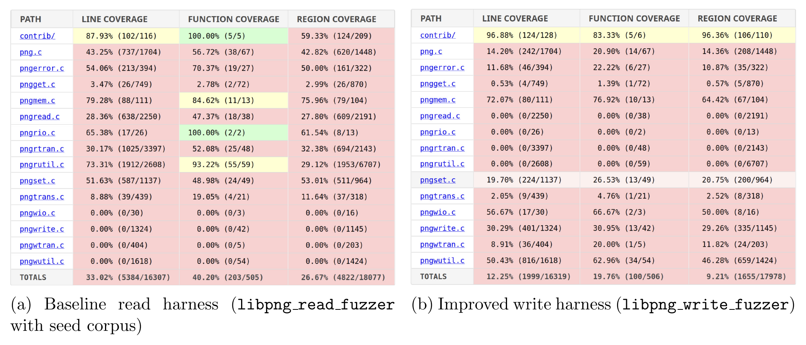

# Fuzzing and Vulnerability Analysis of libpng

**Group Security Research Project**

**About Fuzzing:** Fuzzing is an automated software testing technique that provides invalid, unexpected, or random data as inputs to a program to discover bugs and vulnerabilities. Coverage-guided fuzzing uses code coverage feedback to intelligently explore different execution paths.

**About OSS-Fuzz:** OSS-Fuzz is Google's continuous fuzzing service for open-source software. It uses LibFuzzer and other fuzzing engines to automatically test critical open-source projects and report vulnerabilities.

This project demonstrates coverage-guided fuzzing, code coverage analysis, and vulnerability exploitation using Google's OSS-Fuzz framework on the libpng library.

**Target:** libpng v1.6.48 (fuzzing), v1.5.20 (exploitation)

📄 **For detailed methodology and full report:** See `report.pdf`  
📋 **For complete instructions:** See `Instructions.md`

---

## 📊 Results Summary

### Part 1: Seed Corpus Impact Analysis

| Metric | WITH Corpus | WITHOUT Corpus | Improvement |
|--------|-------------|----------------|-------------|
| **Line Coverage** | 41.83% | 24.76% | **+17.07%** |
| **Branch Coverage** | 35.49% | 21.03% | **+14.46%** |
| **Function Coverage** | 50.75% | 34.75% | **+16.00%** |


### Part 3: Custom Fuzzer Improvements

**Improvement 1 - Enhanced Read Fuzzer** ([submit_improve1](https://github.com/Enessar/oss-fuzz/tree/submit_improve1))

- Line Coverage: 33.02% → 34.08% **(+1.06%)**
- Added PNG transformation API calls and edge case testing
- +74 lines in `pngread.c`, +73 lines in `pngtrans.c`

**Improvement 2 - Write Fuzzer** ([submit_improve2](https://github.com/Enessar/oss-fuzz/tree/submit_improve2))

- Created new fuzzer for PNG **encoding** (write operations)
- Write functions: 0% → 30-50% coverage
- **+1,270 lines** of previously untested code covered




### Part 4: CVE-2014-9495 Exploitation

Successfully exploited **heap buffer overflow** in libpng v1.5.20:
- Integer overflow in Adam7 interlaced PNG processing
- PoC triggers AddressSanitizer detection
- Script: `part4/run.poc.sh`

---

## 🏆 Achievements

✅ **Seed corpus impact:** +17% coverage improvement  
✅ **Custom fuzzers:** 2 new variants (enhanced read + write fuzzer)  
✅ **Novel coverage:** +1,270 lines of previously untested code  
✅ **CVE exploitation:** Successful PoC for CVE-2014-9495

---

## � Project Structure

```
├── part1/               # Seed corpus impact analysis
│   ├── run.w_corpus.sh         # Run with seed corpus
│   ├── run.w_o_corpus.sh       # Run without seed corpus
│   └── report/                 # Coverage reports
├── part3/               # Custom fuzzer improvements
│   ├── improve1/               # Enhanced read fuzzer
│   └── improve2/               # New write fuzzer
└── part4/               # CVE-2014-9495 exploitation
    ├── run.poc.sh              # Run exploit
    └── write_exploit.c         # PoC code
```

---

## � Quick Start

```bash
# Part 1: Fuzzing experiments (4 hours each)
cd part1
./run.w_corpus.sh    # or ./run.w_o_corpus.sh

# Part 3: Test improvements (4 hours each)
cd part3/improve1 && ./run.improve1.sh
cd part3/improve2 && ./run.improve2.sh

# Part 4: Exploit CVE
cd part4 && ./run.poc.sh
```

**View coverage reports:**
```bash
firefox part1/report/w_corpus/linux/index.html
```

## 👥 Group Members

This security research project was completed collaboratively by:

- **Mahdi Atallah**
- **Rassene M'Sadaa**
- **Yannik Krone**
- **Yonathan Lanzmann**